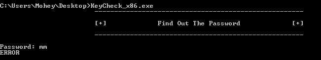
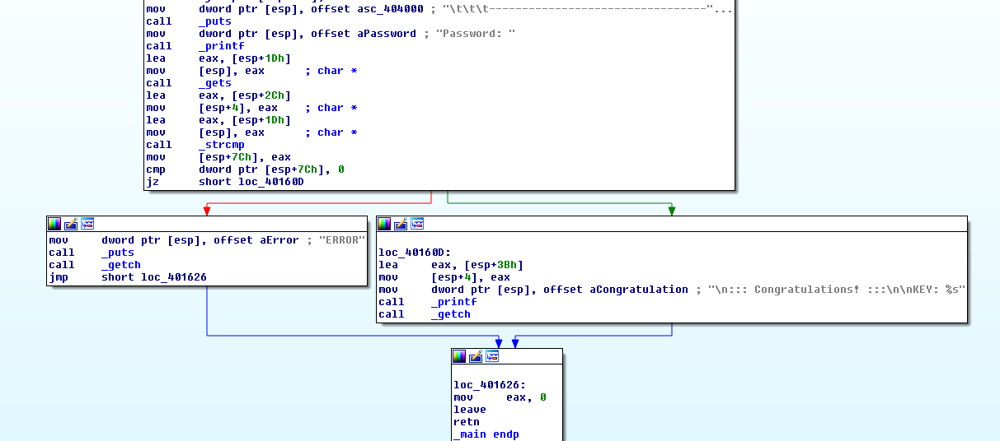
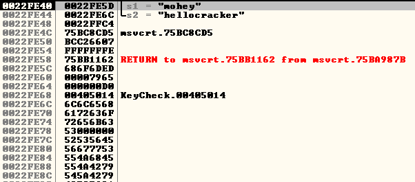
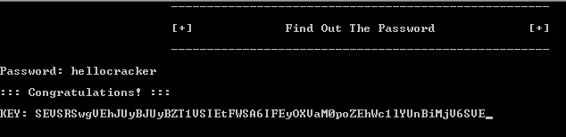

# Challenge Link

[KeyCheck_x86](https://crackmes.one/crackme/5e5b9aaa33c5d4439bb2dd17)

# Level 
2

# Description 

>KeyCheck_x86 is a x86(32bit) simple executable program/ cracking challenge for beginners. Try To Find Password, Enjoy!

# Solution 

In this challenge We are given a 32 bit executable, when executing it, it asks for the password. 

So, our challenge is to find the right password. 

let's load this executable into IDA and see how it works. 

As we can see there is a comparison between our input and some value stored on the stack. 

Simply, we can use any debugger to see what is stored on the stack before strcmp is called...I'll use ollydbg for this challenge. 

setting a breakpoint before strcmp is called and we can see what is stored on the stack. 

As we can see the s1 which is my input will be compared with `hellocracker` which should be the right password.  

