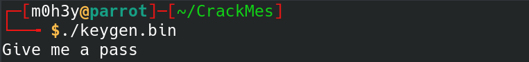
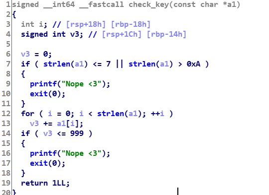
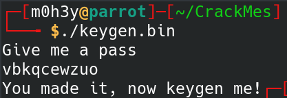

# Challenge Link

[Keyg3n_M1#1](https://crackmes.one/crackme/5e66aea233c5d4439bb2dde8)

# Level 
1

# Description

>It's easy to break me! I want you to keygen me

# Solution 

We are given a 64-bit ELF. when running it, it asks for the pass. 



If we loaded this binary into IDA, we can see our input is checked using a function called `check_key`. 




This function first checks the length of our input if it wasn't between 8 to 10 character, it will print `Nope <3` and exits otherwise, it will calcaulate the sum of the ascii values of the input characters and then checks if this sum is less then or equal to 999, it will also print `Nope <3`. 

So our challenge is to generate a password whose length is between 8 to 10 characters and sum of its ascii values of its characters is greater than 1000. 

Here is a simple script i've made with python to generate that key.
```python
import string
import random
str=""
for i in range(0,11):
    str += random.choice(string.ascii_lowercase)
    if 8 <= len(str) <= 10 :
        if sum(map(ord, str)) < 1000:
            continue
        else:
            print(str)
            break
```

this code will generate a random key each time we run it.... let's try any generated key we got. 


